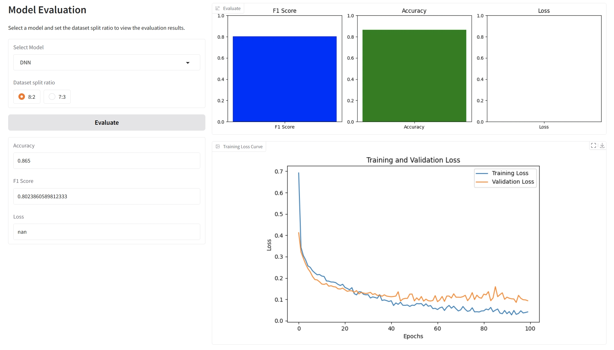

# Diabetes Classification With Machine Learning



# Project Environment Setup Guide

## 1. Install Python and pip

Make sure that Python and `pip` are installed on your system. You can verify the installation by running the following commands:

```bash
python --version
pip --version
```


If Python is not installed, please visit the [Python official website](https://www.python.org/downloads/) to download and install it.

If `pip` is not installed, you can refer to the [pip official documentation](https://pip.pypa.io/en/stable/) for installation.

## 2. Create a Virtual Environment (Optional but Recommended)

To avoid affecting the global environment, it is recommended to install the dependencies in a virtual environment. You can create a new virtual environment by running the following command:

```bash
python -m venv myenv
```

Activate the virtual environment by using:

- **Windows**:
  ```bash
  myenv\Scripts\activate
  ```
- **macOS/Linux**:
  ```bash
  source myenv/bin/activate
  ```

Once the virtual environment is activated, the command prompt will show the name of the virtual environment, indicating that you are working within it.

## 3. Install Dependencies

Make sure the `requirements.txt` file is located in the root directory of your project. Navigate to the directory containing this file and run the following command to install all the dependencies:

```bash
pip install -r requirements.txt
```

This command will automatically install all the Python libraries listed in `requirement.txt`.

## 4. Verify Installation

After installation, you can verify the installed libraries by running:

```bash
pip list
```

This will display a list of all installed libraries and their versions, ensuring that the libraries from `requirements.txt` have been successfully installed.

## 5. Deactivate the Virtual Environment

Once you're done, you can deactivate the virtual environment by running:

```bash
deactivate
```

## 6. Run the Project

After installing the required dependencies in the virtual environment, you can start the project. For example, you can run the UI.py directly.

```bash
python UI.py
```

---

Thank you for using this project! If you encounter any issues, feel free to contact the maintainer.
